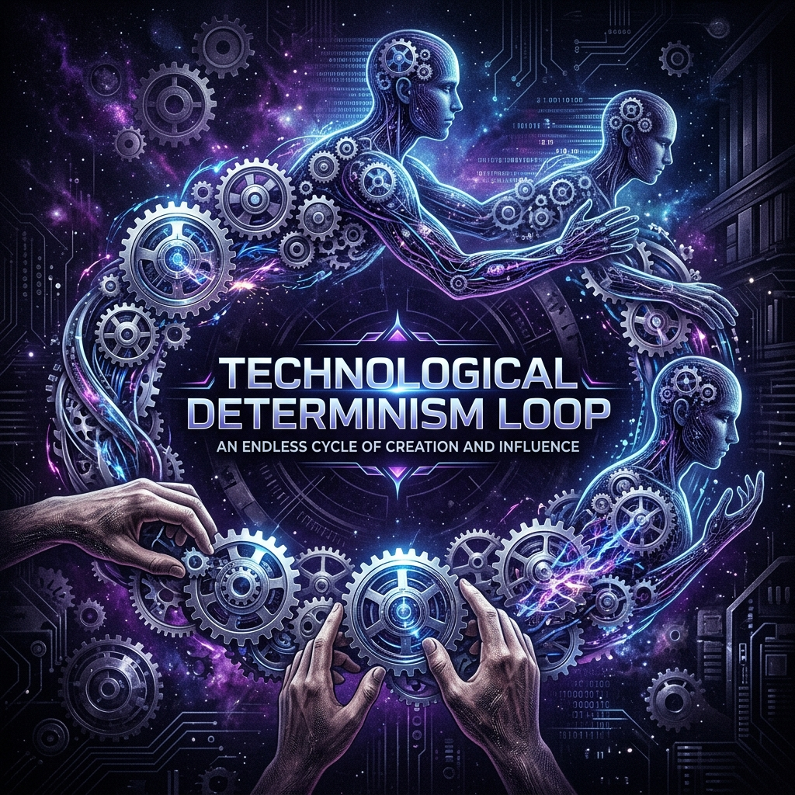

<div align="center">



# 🌪️ Teknolojik-Determinizm-Döngüsü 🌪️
### *Philosophy, Ontic Mechanization, and the Hanif AI Exit Path*

[](https://opensource.org/licenses/MIT)
[](#)
[

> **"Önce biz teknolojiyi yaratırız, sonra o bizi yeniden yaratır."**
> *(First we shape our tools, thereafter they shape us.)*

[Manifesto](#-proje-manifestosu) • [The Loop](#-döngünün-anatomisi) • [Hanif Tech](#-döngüyü-kırmak) • [Structure](#-proje-yapısı) • [Simulation](#-simülasyon)

</div>

---

## 📖 Proje Manifestosu

Modern çağın en büyük ontolojik paradoksu: **Makineler insanlaşırken, insanlar makineleşmektedir.** 

Bu repository, Abdurrahman Bulut'un felsefi analizlerinden yola çıkarak; yapay zekanın sadece bir araç değil, insan fıtratını (doğasını) dönüştüren bir "determinizm döngüsü" yarattığını savunur. Amacımız, bu döngüyü kıracak teknik ve felsefi alternatifler (Hanif Teknoloji) üretmektir.

---

## 🔄 Döngünün Anatomisi (The Determinism Loop)

İnsan ve teknoloji arasındaki bu karşılıklı dönüşüm şu aşamalardan geçer:


1. **Yansıtma:** İnsan, kendi analitik zekasını makineye aktarır.
2. **Bağımlılık:** Sistem, verimlilik adına insanı kendi mantığına (veriye) uymaya zorlar.
3. **Mekanikleşme:** İnsan, kararlarını makineye devrettikçe vicdan ve hikmet melekelerini kaybeder.

---

## 🛡️ Döngüyü Kırmak: Hanif Teknoloji

Döngüden çıkış yolu, teknolojiyi reddetmek değil, onu **Yapay Vicdan (Artificial Conscience)** ile "fitra-aware" hale getirmektir.

- **Analitik Katman:** Soğuk veri işleme.
- **Vicdan Katmanı:** Evrensel değer filtresi.
- **Yapay Akıl:** Değer odaklı nihai irade.

---

## 📂 Proje Yapısı

* 📚 **[/teorik-cerceve](teorik-cerceve/)**: Determinizm ve fıtrat üzerine derinlemesine analizler.
* 📉 **[/degerler-erozyonu-analizleri](degerler-erozyonu-analizleri/)**: Mekanikleşmenin toplumsal vaka çalışmaları.
* 🛠️ **[/cikis-stratejileri](cikis-stratejileri/)**: Hanif mimari tasarımları ve çıkış haritaları.
* 🧪 **[/iHuman-sendromu](iHuman-sendromu/)**: iHuman sendromu üzerine düşünce deneyleri.
* 💻 **[/src](src/)**: Hanif AI Mimarisinin kavramsal prototipi.

---

## 🚀 Simülasyon

Hanif AI'nın "Döngüyü Kırma" anını canlı izlemek için:

```bash
python main.py
```

---

<div align="center">
  <p><i>"İnsanın kendi yarattığı araçların ontolojik kölesi olmaması için."</i></p>
  
</div>